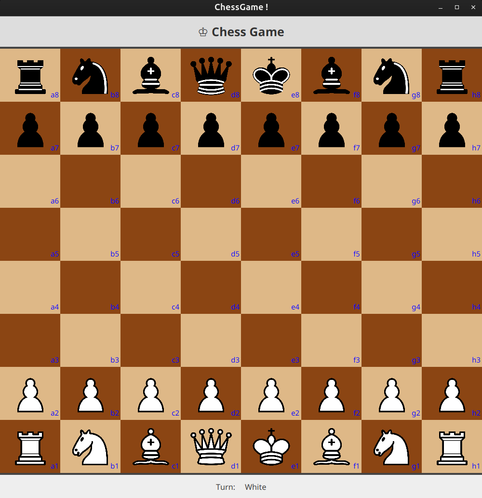
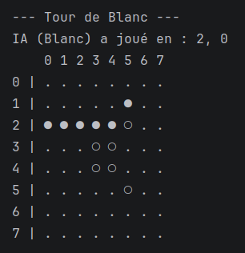
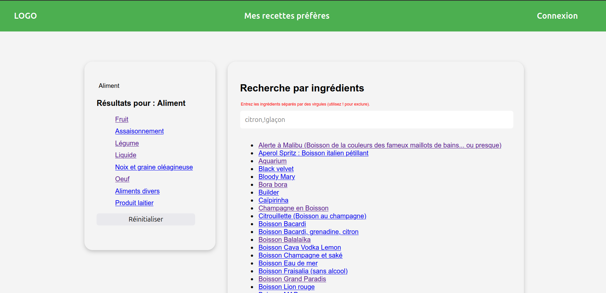

# 👋 Hi, I'm Corentin

🎓 I'm a **Master 1 Computer Science student** with a strong interest in new technologies and software development.

---

## 💻 About Me
- 📚 Currently studying **Computer Science (Master 1)**
- 🚀 Passionate about **programming, hardware, and networking**
- 🌱 Always learning and improving my technical skills

---

## 🛠️ Skills & Technologies

### 💻 Languages

### 🗄️ Database

### ⚙️ Frameworks & Libraries

### 🧰 Tools & Platforms

---

## 📌 Projects

### ♟️ Chess Game
> Chess game made in Java and JavaFX.

  

---

### 🤖 Othello AI
> Othello game developed in Java using MinMax and Alpha–Beta pruning algorithms.

  

---

### 🍹 Web Project - Cocktail
> Academic project developed with Romaric Henry, showcasing PHP, JavaScript, and backend database integration.

  

---

## 🌱 Currently Learning
- Advanced algorithms and data structures
- Software architecture and design patterns

---

## 📫 Contact
- **GitHub:** [MinaroliCorentin](https://github.com/MinaroliCorentin)

---

⭐ *Feel free to explore my repositories and reach out if you'd like to collaborate!*
